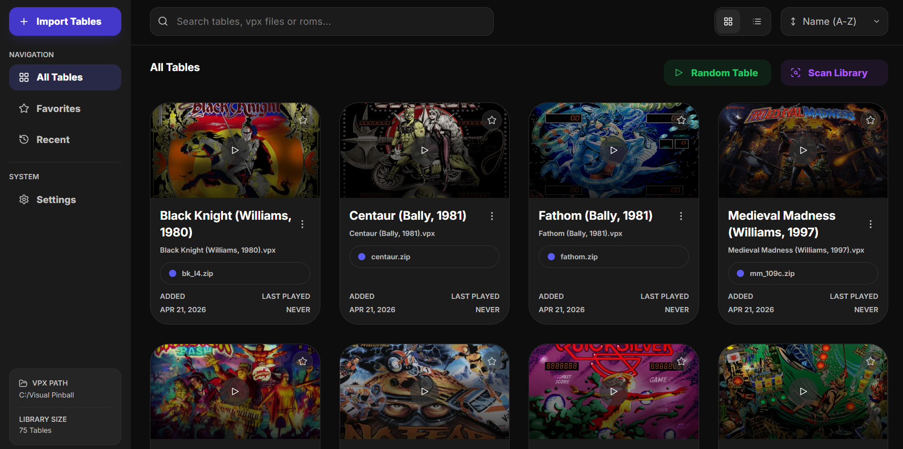
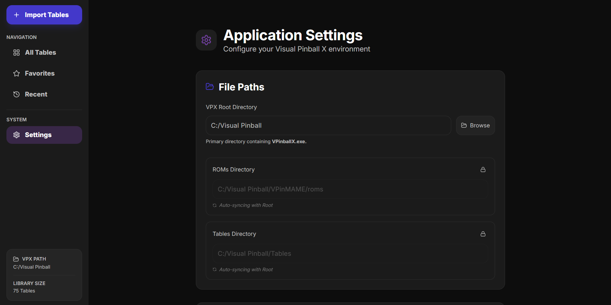
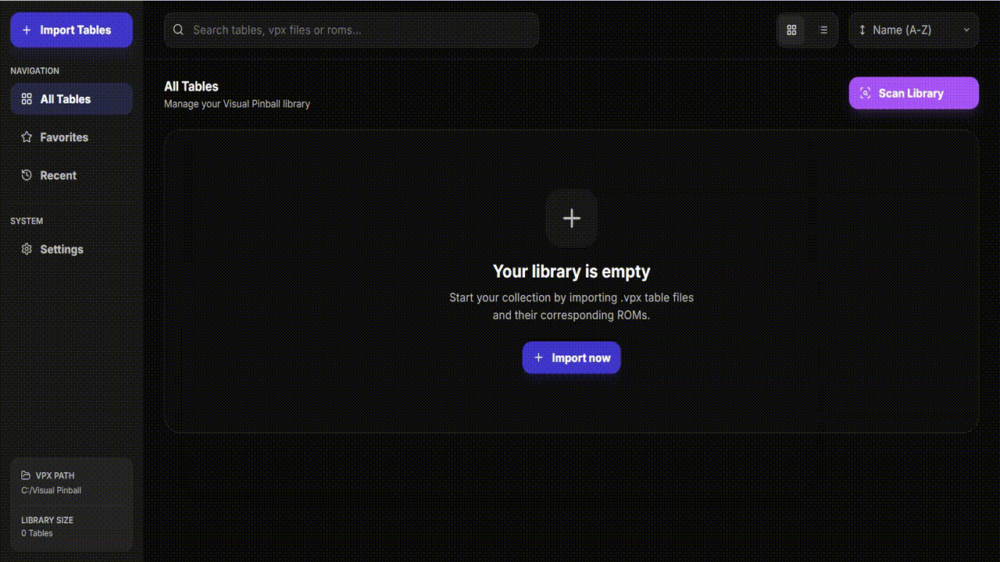
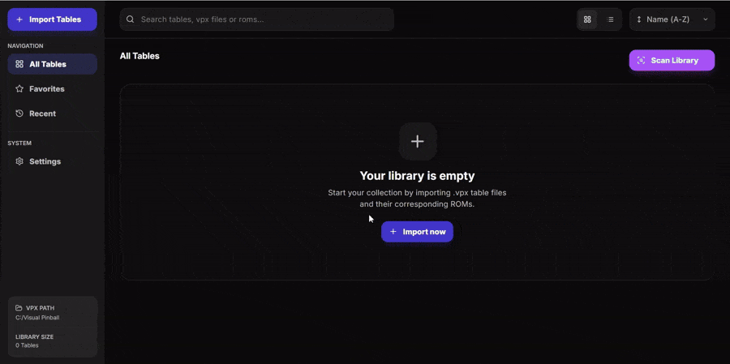
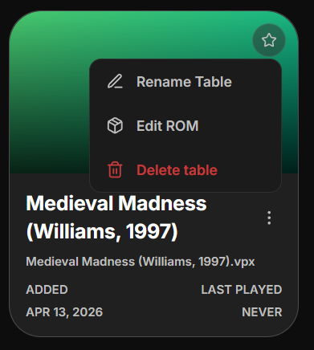
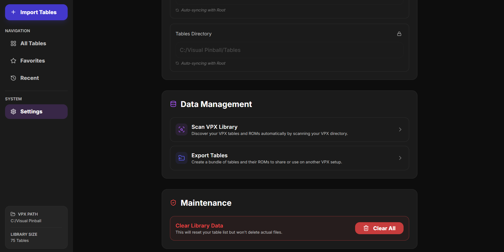
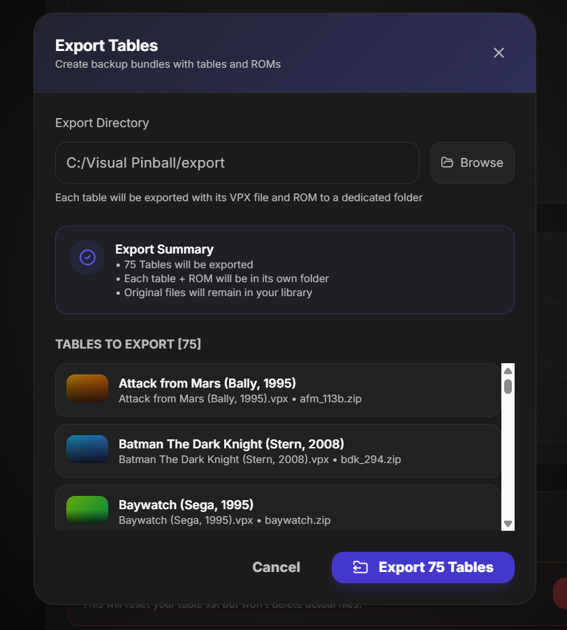

# VPX Micro Frontend — Usage Guide

This guide explains how to use the app day-to-day to manage your Visual Pinball X tables and ROMs.



## What you can do

- Import `.vpx` tables and `.zip` ROM files
- Scan your VPX folder and auto-detect tables/ROMs
- Search, sort, and favorite tables
- Launch tables from the app
- Rename or delete entries
- View recently played tables
- Export a bundle of tables + ROMs

## First-time setup



1. Open **Settings** from the left navigation.
2. In **File Paths**, set **VPX Root Directory** (the folder containing `VPinballX.exe`).
3. Confirm **ROMs Directory** and **Tables Directory**.
   - These auto-sync with the root path by default, but you can override if needed.

## Add tables to your library

If you already have an existing VPX setup, start with Scan Library first.

### Option A: Scan your VPX library



1. Click **Scan Library** (top-right) or open it from **Settings → Data Management**.
2. Review detected matches.
3. Apply results.

### Option B: Import files/folders



1. Click **Import Tables**.
2. Drag/drop `.vpx`, `.zip`, or folders.
3. Review detected tables and unassigned ROMs.
4. Optionally enable **Delete original files after import**.
5. Click **Import Tables**.

## Work with tables

### All Tables

- Use search to match table name, `.vpx` filename, or ROM filename.
- Use the order picker to sort.
- Toggle **Keep favorites on top**.

### Favorites

- Click the ⭐ on a table card to favorite/unfavorite.

### Recently Played

- Tables appear here after they are launched.
- Sort picker is shown but disabled in this view.

### Table card actions



- **Play** button launches the table.
- **Kebab menu** lets you:
  - Rename table
  - Edit ROM
  - Delete table

## Settings reference

### File Paths

- VPX root path
- ROMs directory
- Tables directory

### Data Management



- **Scan VPX Library**
- **Export Tables** (create a shareable bundle)



### Maintenance

- **Clear Library Data** resets app metadata/list only.
- It does **not** delete your actual VPX/ROM files.

## Minimal run notes (dev)

If you are running this locally from source:

```bash
yarn install
yarn dev
```

## Build Windows binaries (EXE)

This project now supports production packaging via Electron Builder.

### 1. Install dependencies

```bash
yarn install
```

### 2. Build production assets only

```bash
yarn build:prod
```

This creates:

- `out/` (static Next renderer)
- `dist-electron/main.js` and `dist-electron/preload.js` (bundled Electron files)

### 3. Create Windows distributables

```bash
yarn dist:win
```

Artifacts are written to `dist/`:

- NSIS installer `.exe`
- Portable `.exe`

### 4. Create unpacked app only (quick local validation)

```bash
yarn dist:dir
```

This outputs `dist/win-unpacked/`.

### Notes

- Packaging is Windows-first in the current setup.
- If Defender/permissions interfere with packaging, run the terminal as Administrator and retry.
- Optional polish for release: set `author`, `description`, and app icon in `package.json`.

## Troubleshooting

- If scan/import appears outdated, re-open the view or run a fresh scan.
- If local test data gets messy during development:

```bash
yarn db:reset
```
