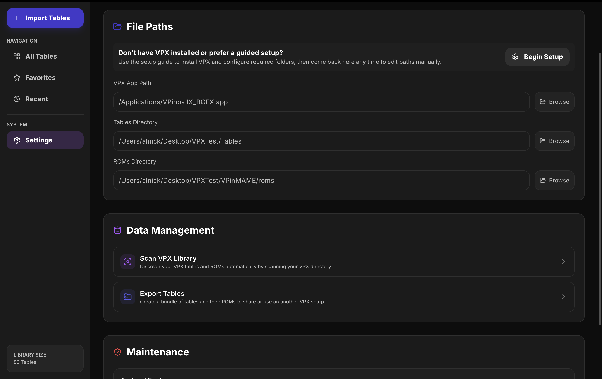
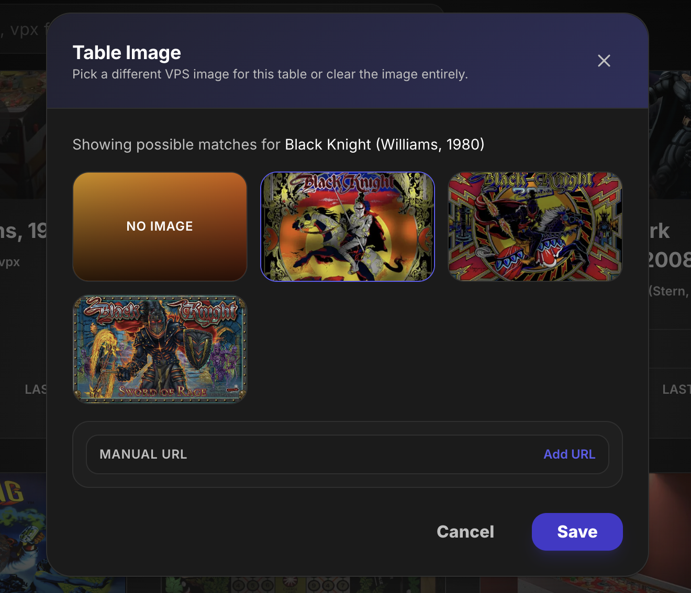
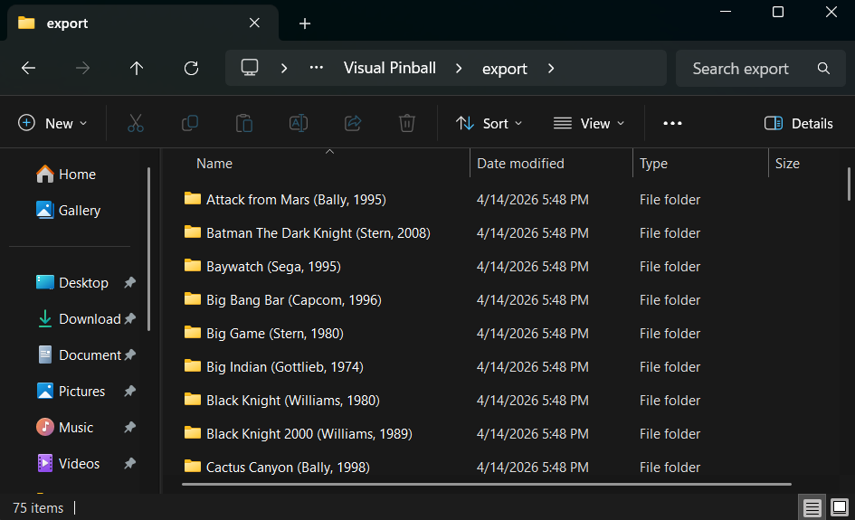
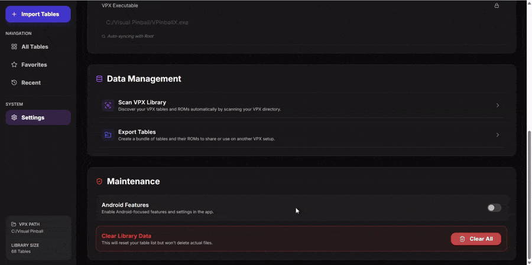
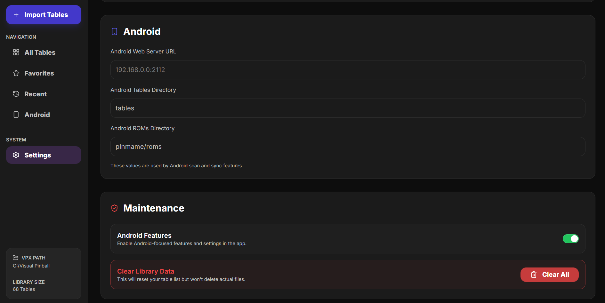
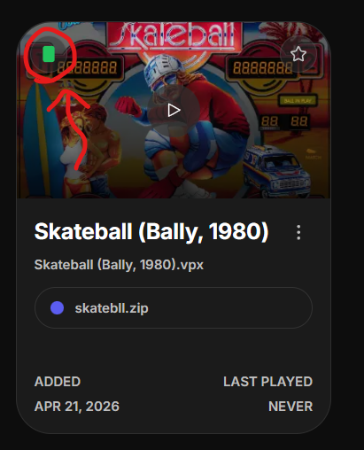

# VPX Micro Frontend — Usage Guide

This guide explains how to use the app day-to-day to manage your Visual Pinball X tables and ROMs.


## Table of Contents

- [What you can do](#what-you-can-do)
- [Install](#install)
- [First-time setup - Windows](#first-time-setup---windows)
- [First-time setup - macOS](#first-time-setup---macos)
- [Add tables to your library](#add-tables-to-your-library)
- [Work with tables](#work-with-tables)
- [Settings reference](#settings-reference)
- [Minimal run notes (dev)](#minimal-run-notes-dev)

## What you can do

- Import `.vpx` tables and `.zip` ROM files
- Scan your VPX folder and auto-detect tables/ROMs
- Search, sort, and favorite tables
- Auto-detect table image with manual overrides
- Play a random table from your selected library
- Launch tables from the app
- Rename, delete, or archive entries
- View recently played tables
- Export tables (all, favorites, or archived)
- Connect Android mobile devices to sync selected tables and ROMs (experimental)

## Install

Download the latest build from GitHub Releases for your platform:

- [VPX Micro Frontend Releases](https://github.com/AAmanzi/vpx-micro-frontend/releases)

### Windows

**Download options:**

- **Installer (recommended)**
  - Standard Windows installation flow
  - Creates Start Menu/Desktop shortcuts
  - Best for most users

- **Portable (`.exe`)**
  - No installation required
  - Run directly from any folder or USB drive
  - Good for testing or restricted environments

**Smart App Control (Windows 11):**

Some systems have Smart App Control enabled, which can block unsigned apps completely.

If the app does not start at all (no **Run anyway** option), you may need to disable Smart App Control:

`Windows Security → App & browser control → Smart App Control → Off`

### macOS

**Download and install:**

1. Download the `.dmg` file from releases
2. Open the `.dmg` file
3. Drag the VPX Micro Frontend app into the **Applications** folder
4. Open Applications and launch **VPX Micro Frontend**

After installation, open the app and continue with first-time setup below.

## First-time setup - Windows


1. Open **Settings** from the left navigation.
2. In **File Paths**, set **VPX Root Directory** (the folder containing `VPinballX.exe`).
3. Confirm **ROMs Directory** and **Tables Directory**.
   - These auto-sync with the root path by default, but you can override if needed.

## First-time setup - macOS

The app includes a guided setup wizard to help you configure VPX on macOS.



**Guided Setup (Recommended):**

Click **Begin Setup** in the Settings → File Paths section to start a step-by-step guide that covers:
1. Installing/locating VPX
2. Configuring the VPX executable path
3. Setting up Tables and ROMs folders
4. Configuring ROM support (PinMAME)

**Manual Setup:**

This expects that you already have VPX and PinMAME installed and configured on your Mac.

1. Open **Settings** from the left navigation.
2. In **File Paths**, set the paths to your VPX installation:
   - **VPX App Path**: path to `VPinballX_BGFX.app` bundle
   - **Tables Directory**: where your `.vpx` files are stored
   - **ROMs Directory**: where your ROM files (`.zip`) are stored

## Add tables to your library

If you already have an existing VPX setup, start with Scan Library first.

### Option A: Scan your VPX library


1. Click **Scan Library** (top-right) or open it from **Settings → Data Management**.
2. Review detected matches.
3. Apply results.

### Option B: Import files/folders


1. Click **Import Tables**.
2. Drag/drop `.vpx`, `.zip`, or folders.
3. Review detected tables and unassigned ROMs.
4. Optionally enable **Delete original files after import**.
5. Click **Import Tables**.

## Work with tables

### All Tables

- Use search to match table name, `.vpx` filename, or ROM filename.
- Use the order picker to sort.
- Toggle **Keep favorites on top**.
- Click **Random Table** to play a random table from your library.

### Favorites

- Click the ⭐ on a table card to favorite/unfavorite.

### Archive

- Archive tables you want to hide from your active library.
- Archived tables remain in your database and can be restored anytime.
- Use the **Archive** tab to view and manage archived tables.

### Recently Played

- Tables appear here after they are launched.
- Sort picker is shown but disabled in this view.

### Table card actions


- **Play** button launches the table.
- **Kebab menu** lets you:
  - Rename table
  - Edit ROM — set the ROM file associated with this table
  - Table Image (if available from VPS DB) — click to view or edit image selection from alternate results.
  - VPX Executable — set a different VPX exe file per table (overrides the global one)
  - Delete Table — removes the DB entry and deletes the table's files from VPX folders
  - Archive / Unarchive table — archive the table to hide it from your active library.

### Table Images

Table images are automatically fetched from the [Virtual Pinball Spreadsheet database](https://virtualpinballspreadsheet.github.io/vps-db/db/vpsdb.json). If an image isn't available or you want to use a different one:

1. Open the table **Kebab menu** and click **Table Image**.
2. Browse alternate image results for that table.
3. Select the image you prefer, or manually enter a custom image URL.



Images are cached locally; if the VPS DB is unavailable, your previously cached images remain visible.
There's also a snapshot of VPS DB as backup at [VPS Backup snapshot](https://aamanzi.github.io/vps-db/db/vpsdb.json)

## Settings reference

### File Paths

- VPX root path
- ROMs directory
- Tables directory
- VPX executable path (global/default launcher)
- Direct link to VPX Releases (onboarding helper)

### Data Management


- **Scan VPX Library** — detect and auto-match tables and ROMs
- **Export Tables** — create a shareable bundle with options:
  - Export all tables
  - Export favorites only
  - Export archived tables only




### Android (Experimental)



- Enable Android Features in Settings > Maintenance
- Mark tables as "Android" and preview them in the Android tab
- From the **Android tab**, select **Sync Android**
- Preview Changes and sync your libraries





#### Android Settings

- **Android Web Server URL**
- **Android Tables Directory** — advanced setting; change only if you know what you're doing
- **Android ROMs Directory** — advanced setting; change only if you know what you're doing

#### Android Device Setup

The app does not include an Android application. Instead, it syncs files to a folder on your Android device over the network.

To use Android sync, you need a VPX-compatible Android environment on your device.

You can find Android builds here:
https://github.com/vpinball/vpinball/releases

Install the provided `.apk` (usually included in the release `.zip`).

---

#### Enabling the Android server from device

On your Android device:

1. Start VPX
2. Open settings for any table (or global settings depending on build)
3. Enable **Web Server**
4. A **server URL (IP address)** will be shown

### Maintenance

- **Clear Library Data** resets app metadata/list only.
- It does **not** delete your actual VPX/ROM files.
- **Database Migrations** run automatically on app update to keep existing data compatible.

### VPX utilities

- **Open VPX Folder** opens the configured VPX root folder for quick manual checks/cleanup.
- **Run VPX** launches VPX without loading a table.

## Minimal run notes (dev)

If you are running this locally from source:

```bash
yarn install
yarn dev
```

### Data mocking notes

You can mock VPX by creating empty folders and pointing the app to them in **Settings → File Paths**.

Use this structure:

```text
/mockVpxFolder
  /Tables
  /VPinMAME
    /roms
```

Then set **VPX Root Directory** to `/mockVpxFolder`.

The app will default the table and ROM paths to:

- `/mockVpxFolder/Tables`
- `/mockVpxFolder/VPinMAME/roms`

## Build and package for distribution

This project supports production packaging via Electron Builder for Windows and macOS.

### 1. Install dependencies

```bash
yarn install
```

### 2. Build production assets only

```bash
yarn build:prod
```

This creates:

- `out/` (static Next renderer)
- `dist-electron/main.js` and `dist-electron/preload.js` (bundled Electron files)

### 3. Create Windows distributables

```bash
yarn dist:win
```

Artifacts are written to `dist/`:

- NSIS installer `.exe`
- Portable `.exe`

### 4. Create macOS distributable

```bash
yarn dist:mac
```

Artifacts are written to `dist/`:

- `.dmg` file (drag-and-drop installer)

### 5. Create unpacked app only (quick local validation)

```bash
yarn dist:dir
```

This outputs `dist/win-unpacked/` (or platform-specific equivalent).

### Notes

- Builds are platform-specific; run on Windows to build `.exe` and on macOS to build `.dmg`.
- If Defender/permissions interfere with Windows packaging, run the terminal as Administrator and retry.
- macOS builds require Xcode command-line tools: `xcode-select --install`

## Troubleshooting

- If scan/import appears outdated, re-open the view or run a fresh scan.
- If local test data gets messy during development:

```bash
yarn db:reset
```
